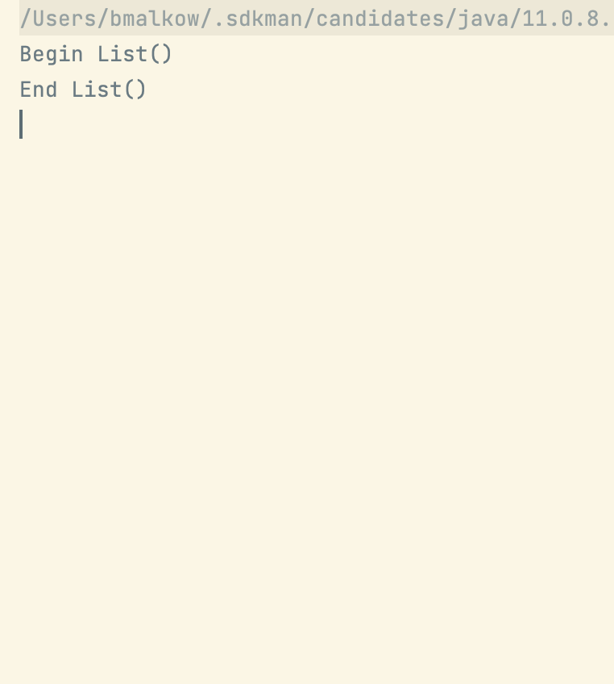
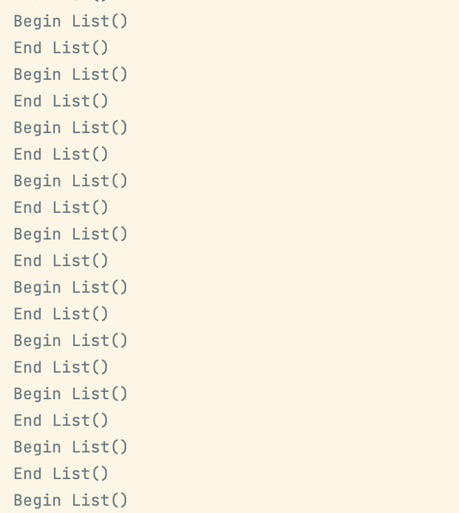

# ListState Problem Demo

This is short Kotlin Compose Desktop application that demonstrates the problem with call `listState.layoutInfo` inside `@Composable` function.
After this call, whole function is started again and again and again.

Use simple `./gradlew run` to start demo.

When line `listState.layoutInfo` is commented, then output to stdout is:

But when this line is not commented, then we have:
